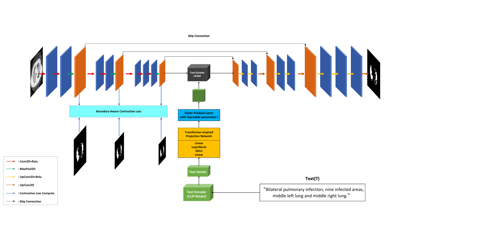

# Boundary-Aware Contrastive Learning for Text-Guided COVID-19 Segmentation

Paper-aligned PyTorch reference implementation for:

> **Boundary-Aware Contrastive Learning for Text-Guided COVID-19 Segmentation in Chest X-Ray and CT Images**  
> Baoyang Han and Jia Wei

The model combines a three-stage VGG16 encoder-decoder, CLIP text embeddings, a learnable 512 -> 384 -> 256 text projection, cross-position attention, and a multi-scale foreground/mask-positive/background-negative contrastive objective.



## Reproducibility status

This repository was reconstructed from the manuscript and the supplied three-file research snapshot. It fixes several material mismatches in that snapshot, including unused contrastive projection heads, the reversed attention multiplication, a non-1x1 output head, broken left/right text augmentation, incomplete checkpointing, and missing inference/evaluation code.

Because these corrections alter trainable computation, **old checkpoints are not compatible and the paper's reported scores have not been independently reproduced with this release**. Retrain and regenerate per-case results before associating a release tag with the manuscript's tables. See [the full consistency audit](docs/METHOD_CODE_AUDIT.md).

## Repository layout

```text
BACL-COVID19/
├── assets/                 # Architecture figure
├── configs/                # QaTa-COV19 and MosMedData examples
├── data/README.md          # Data layout and metadata schema
├── docs/METHOD_CODE_AUDIT.md
├── scripts/
│   ├── train.py
│   ├── evaluate.py
│   ├── infer.py
│   └── compare.py
├── src/bacl/               # Model, loss, data, metrics, utilities
├── tests/
├── CITATION.cff
├── LICENSE
├── requirements.txt
└── pyproject.toml
```

## Environment

Python 3.10 or 3.11 is recommended. Install PyTorch using the command appropriate for your CUDA version if necessary, then install the project:

```bash
python -m venv .venv
source .venv/bin/activate  # Windows PowerShell: .venv\Scripts\Activate.ps1
python -m pip install --upgrade pip
python -m pip install -r requirements.txt
python -m pip install -e .
```

Alternatively:

```bash
conda env create -f environment.yml
conda activate bacl-covid19
python -m pip install -e .
```

The default configuration downloads `openai/clip-vit-base-patch32` from Hugging Face and VGG16 ImageNet weights from TorchVision on first use. For an offline CLIP copy, set:

```yaml
model:
  clip_model: /absolute/path/to/clip-vit-base-patch32
  local_files_only: true
```

## Data

The repository does not contain medical images, masks, or annotations. Download QaTa-COV19 and MosMedData from their official distribution pages and obtain the structured text descriptions/fixed splits used by the LViT benchmark protocol.

Metadata may be CSV, TSV, XLS, or XLSX. It should provide image filename and text columns; a separate mask filename column is optional. See [data/README.md](data/README.md) and edit `configs/*.yaml` to match the local layout.

Do not commit datasets to Git. The included `.gitignore` excludes the `data/` contents while keeping `data/README.md`.

## Training

MosMedData:

```bash
python scripts/train.py --config configs/mosmed.yaml
```

QaTa-COV19:

```bash
python scripts/train.py --config configs/qatacov19.yaml
```

Resume a run:

```bash
python scripts/train.py \
  --config configs/mosmed.yaml \
  --resume runs/mosmed/last.pt \
  --output-dir runs/mosmed
```

Each run writes `best.pt`, `last.pt`, a configuration snapshot, and line-delimited training history. Checkpoints include model weights, contrastive projection heads, optimizer, scheduler, epoch, and best validation Dice.

Important configuration notes:

- MosMed uses a linear boundary-loss warm-up from 0.05 to 0.5 over the first 20 epochs, following the manuscript wording.
- The supplied snapshot did not contain QaTa training code or its exact loss weight. The QaTa config uses a clearly marked fixed 0.5 default that must be confirmed against the original records.
- `freeze_clip: false` matches the supplied optimizer behavior. If the experiment actually froze CLIP, update the configuration and manuscript together.
- The reported setup uses 224x224 input, Adam, learning rate 0.001, batch size 8, 120 epochs, random rotation up to 20 degrees, and horizontal flip probability 0.5.

## Evaluation

Evaluate a fixed labeled split and save per-case scores plus normal-approximation 95% confidence intervals:

```bash
python scripts/evaluate.py \
  --config configs/mosmed.yaml \
  --checkpoint runs/mosmed/best.pt \
  --split test \
  --output-dir results/mosmed
```

Outputs:

```text
results/mosmed/
├── per_case.csv
└── summary.json
```

For a paired comparison with a baseline evaluated on the exact same case IDs:

```bash
python scripts/compare.py \
  --proposed results/mosmed/per_case.csv \
  --baseline results/cpam/per_case.csv \
  --output results/mosmed_vs_cpam.json
```

The comparison script reports paired t-tests and a KS check on standardized paired differences. Statistical conclusions require the original matched predictions; they cannot be recovered from aggregate Dice/IoU values alone.

## Single-image inference

```bash
python scripts/infer.py \
  --config configs/mosmed.yaml \
  --checkpoint runs/mosmed/best.pt \
  --image example.png \
  --text "Bilateral pulmonary infection" \
  --output results/example_mask.png
```

Inference uses the image and text only. A ground-truth mask is never passed through the model.

## Reported manuscript results

These are manuscript values, not results re-executed in this repository:

| Dataset | Dice | IoU |
|---|---:|---:|
| QaTa-COV19 | 0.8589 | 0.7523 |
| MosMedData | 0.8023 | 0.6691 |

## Tests

```bash
python -m pip install pytest
pytest -q
```

The smoke tests cover laterality-safe text augmentation, per-case/empty-mask metrics, segmentation loss, contrastive projection use, and gradient flow. Full model training requires the external pretrained weights and datasets.

## Citation

Use GitHub's **Cite this repository** panel, backed by `CITATION.cff`. Add the final journal, volume, pages/article number, and DOI only after publication.

## License

Code is released under the MIT License. Dataset licenses and pretrained-model licenses apply separately. The architecture figure is supplied for documentation of the accompanying manuscript.
